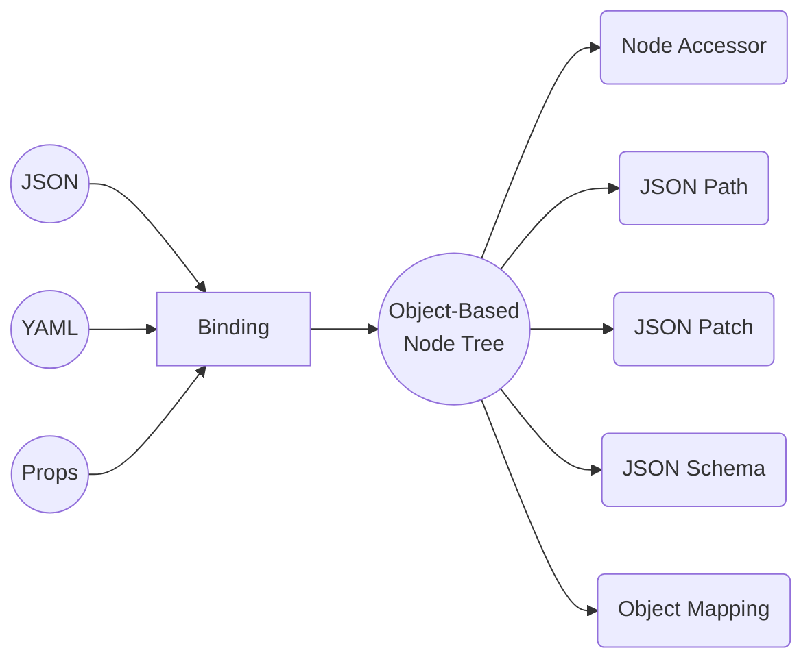
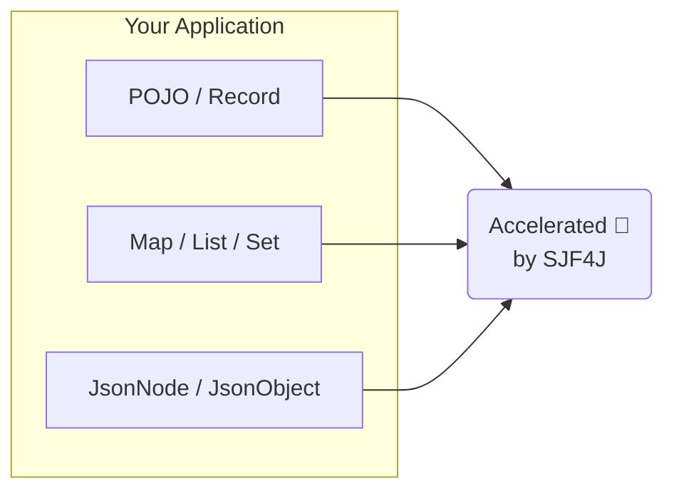

# Architecture

## One Model, Many Capabilities

SJF4J is built around a simple idea:

> **One structural model, many capabilities.**

Instead of maintaining separate representations for parsing, navigation, patching, validation, and mapping, SJF4J uses a single object model called **[OBNT](/docs/modeling.md) (Object-Based Node Tree)**.

Everything operates on the same Java object graph.



This keeps the programming model consistent and avoids unnecessary conversions between different JSON tree representations.

Whether your data comes from Jackson, Gson, YAML, a `POJO`, or a simple `Map`, SJF4J can process it through the same JSON-semantic model.

## How SJF4J Fits Into Your Stack

SJF4J does not replace your existing data model.

It works directly with the Java objects your application already uses:
* POJOs and records
* `Map` / `List`
* arrays
* `JsonObject` / `JsonArray`
* JOJO / JAJO models

Think of SJF4J as a **high-performance structural layer** for these Java object graphs.



It adds JSON Path, JSON Patch, JSON Schema, and object mapping capabilities without introducing another tree model.

### Built for Complex Structures

SJF4J is designed for large and deeply nested object graphs.

By exposing POJOs, maps, JSON objects, and other structures through a unified
structural model, the same APIs can be applied consistently across an entire
application.

### Performance Matters

SJF4J combines high-level APIs with compiled execution plans, generated code,
and optional bytecode acceleration.

For performance-critical workloads, this can eliminate much of the reflection
and interpretation overhead typically associated with structural processing,
often achieving performance close to hand-written code.

## Choose Your Setup

Start with the core module and add capabilities as needed.

```text
sjf4j-schema     ─┐
sjf4j-processor  ─┼─► sjf4j
sjf4j-asm        ─┘
```

### `sjf4j`

Core runtime for object graph processing, binding, JSON Path, and JSON Patch.

Gradle:

```kotlin
implementation("org.sjf4j:sjf4j:{version}")
```

Provides:
- `Sjf4j`: Main facade for binding, conversion, navigation, patching, and runtime configuration.
- `Nodes`: Low-level OBNT utilities for reading, writing, copying, and converting node-shaped Java objects.
- `JsonObject/JsonArray`: Lightweight JSON-oriented object models that participate directly in the OBNT object graph.
- `JsonPath`: RFC 9535-compliant path querying and mutation over OBNT object graphs.
- `JsonPointer`: RFC 6901-compliant pointer-based navigation for exact node access.
- `JsonPatch`: RFC 6902 JSON Patch operations for structural updates.


### `sjf4j-schema`

JSON Schema validation for Java object graphs.


Gradle:
```kotlin
implementation("org.sjf4j:sjf4j-schema:{version}")
```

Provides:
- `JsonSchema`: compiled schema entry point used to validate Java object graphs.
- `SchemaPlan`: validation execution plan derived from a schema document.
- `SchemaRegistry`: reusable schema registry for resolving references and sharing compiled schemas.


### `sjf4j-processor`

Compile-time generation for high-performance path accessors and object mappers.

Gradle:
```kotlin
annotationProcessor("org.sjf4j:sjf4j-processor:{version}")
```

Maven:
```xml
<build>
    <plugins>
        <plugin>
            <groupId>org.apache.maven.plugins</groupId>
            <artifactId>maven-compiler-plugin</artifactId>
            <configuration>
                <annotationProcessorPaths>
                    <path>
                        <groupId>org.sjf4j</groupId>
                        <artifactId>sjf4j-processor</artifactId>
                        <version>{version}</version>
                    </path>
                </annotationProcessorPaths>
            </configuration>
        </plugin>
    </plugins>
</build>
```

Provides:
-`@CompiledPath` — generates typed path accessors so hot-path reads and writes avoid runtime parsing and most reflection overhead.
-`@CompiledMapper` — generates object-to-object mappers for projection and transformation workloads.


### `sjf4j-asm` (Deprecated)

Runtime bytecode path compiler.

Gradle:
```kotlin
implementation("org.sjf4j:sjf4j-asm:{version}")
```

Provides:
- `AsmPathCompiler`: runtime bytecode path compiler, kept for compatibility.


## Features

- [Modeling (OBNT)](./modeling) — the shared object-based node model.
- [Binding (Multi-Format)](./binding) — JSON, YAML, Properties, POJO, JOJO, JAJO, and raw-node binding.
- [Navigating (JSON Path / JSON Pointer)](./navigating) — query and update object graphs.
- [Patching (JSON Patch / Merge Patch)](./patching) — apply structural changes in place.
- [Validating (JSON Schema)](./validating) — validate Java object graphs against JSON Schema.
- [Mapping (Object-to-object)](./mapping) — transform and project object graphs.
- [Benchmarks](./benchmarks) — measured performance and backend comparisons.
- [Schema-to-Java Generator](/generator) — generate Java models from JSON Schema.
