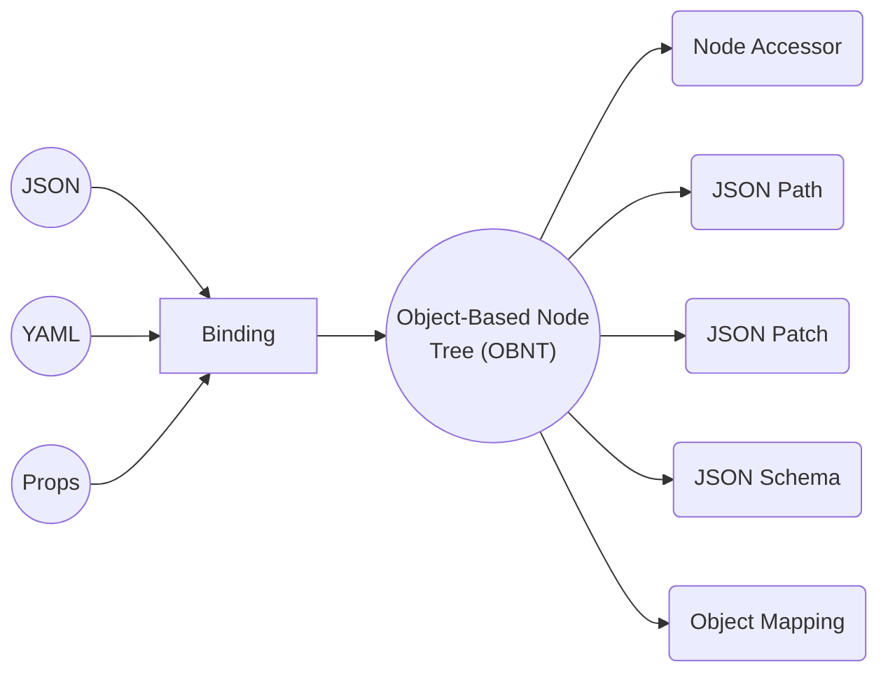
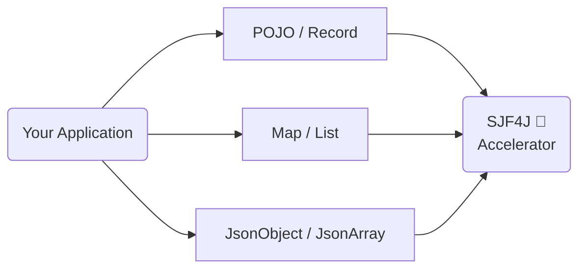

---

title: "SJF4J Architecture"
description: "Understand how SJF4J unifies parsing, navigation, patching, validation, and mapping around a single Java object graph model."
-------------------------------------------------------------------------------------------------------------------------------------------

# Architecture

## One Model, Many Capabilities

SJF4J is built around a simple idea:

> **One structural model, many capabilities.**

Instead of maintaining separate representations for parsing, navigation, patching, validation, and mapping, SJF4J uses a single object model called **[OBNT](/docs/modeling.md) (Object-Based Node Tree)**.

Everything operates on the same Java object graph.



This design keeps APIs consistent and avoids unnecessary conversions between different tree models.

Whether your data comes from Jackson, Gson, YAML, a `POJO`, or a simple `Map`, the same SJF4J APIs can work with it.

---

## How SJF4J Fits Into Your Stack

SJF4J is not a replacement for your existing data model.

It works directly on the objects your application already uses and adds powerful capabilities on top of them.

Think of SJF4J as a **structural accelerator for Java object graphs**.



Rather than introducing another tree model, 
SJF4J adds high-performance structural capabilities directly to the objects you already have.


### Built for Complex Structures

SJF4J is designed for large and deeply nested object graphs.

By exposing POJOs, maps, JSON objects, and other structures through a unified
structural model, the same APIs can be applied consistently across an entire
application.

### Performance Matters

SJF4J combines high-level APIs with compiled execution plans, generated code,
and optional bytecode acceleration.

For performance-critical workloads, this can eliminate much of the reflection
and interpretation overhead typically associated with structural processing,
often achieving performance close to hand-written code.

---

## Choose Your Setup

Start with the core module and add capabilities as needed.

```text
`sjf4j-schema`     ─┐
`sjf4j-processor`  ─┼─► `sjf4j`
`sjf4j-asm`        ─┘
```

### `sjf4j` - Core Runtime

For object graph processing, binding, JSON Path, and JSON Patch.

```kotlin
implementation("org.sjf4j:sjf4j:{version}")
```

Provides:
- `Sjf4j` — main facade for binding, conversion, navigation, patching, and runtime configuration.
- `Nodes` — low-level OBNT utilities for reading, writing, copying, and converting node-shaped Java objects.
- `JsonPath` — RFC 9535-style path querying and mutation over OBNT object graphs.
- `JsonPatch` — RFC 6902 JSON Patch operations for structural updates.

### `sjf4j-schema` - JSON Schema Validation

Add JSON Schema support.

```kotlin
implementation("org.sjf4j:sjf4j-schema:{version}")
```

Provides:
- `JsonSchema` — compiled schema entry point used to validate Java object graphs.
- `SchemaPlan` — validation execution plan derived from a schema document.
- `SchemaRegistry` — reusable schema registry for resolving references and sharing compiled schemas.

### `sjf4j-processor` - Compile-Time Generation

Generate high-performance path accessors and object mappers.

```kotlin
annotationProcessor("org.sjf4j:sjf4j-processor:{version}")
```

Provides:
- `@CompiledPath` implementation — generates typed path accessors so hot path reads/writes avoid runtime parsing and reflection.
- `@CompiledMapper` implementation — generates object-to-object mappers for projection and transformation workloads.

### `sjf4j-asm` Runtime Bytecode Acceleration (Deprecated)

Optional runtime-generated path accessors.

| Module      | Purpose                       |
| ----------- | ----------------------------- |
| `sjf4j-asm` | Runtime bytecode acceleration |

```kotlin
implementation("org.sjf4j:sjf4j-asm:{version}")
```

Provides:
- `AsmPathCompiler` — runtime bytecode path compiler; kept for compatibility, but compile-time generation is preferred.


## Features

- [Modeling (OBNT)](./modeling) — the shared object-based node model.
- [Binding (Multi-Format)](./binding) — JSON, YAML, Properties, POJO, JOJO, JAJO, and raw-node binding.
- [Navigating (JSON Path / JSON Pointer)](./navigating) — query and update object graphs.
- [Patching (JSON Patch / Merge Patch)](./patching) — apply structural changes in place.
- [Validating (JSON Schema)](./validating) — validate Java object graphs against JSON Schema.
- [Mapping (Object-to-object)](./mapping) — transform and project object graphs.
- [Benchmarks](./benchmarks) — measured performance and backend comparisons.
- [Schema-to-Java Generator](/generator) — generate Java models from JSON Schema.
