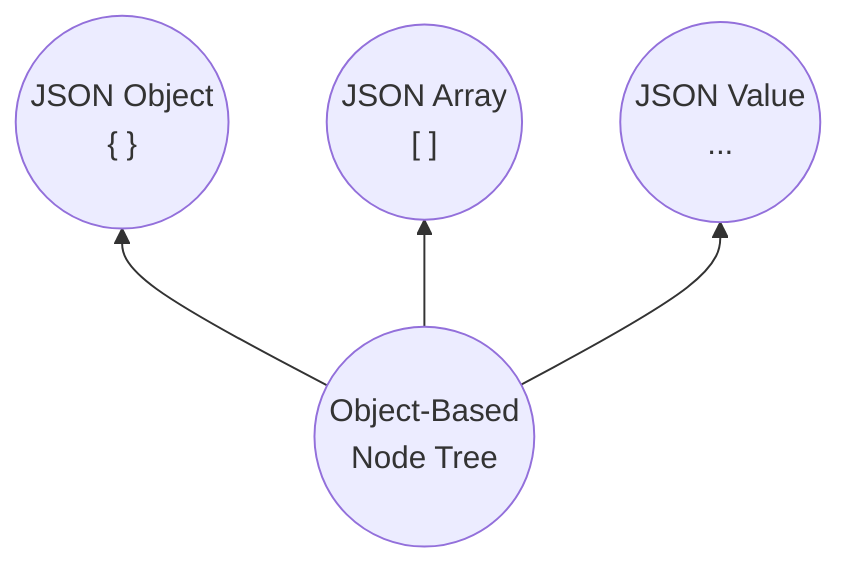

# SJF4J — Simple JSON Facade for Java


[](https://central.sonatype.com/search?q=sjf4j)
[](https://javadoc.io/doc/org.sjf4j/sjf4j)
  


    

[](https://codecov.io/gh/sjf4j-projects/sjf4j)


SJF4J is a lightweight JSON facade for Java, 
evolving into **a high-performance structural processing layer built around JSON standards and semantics**.
   
SJF4J integrates with JSON parsers including [Jackson](https://github.com/FasterXML/jackson-databind),
[Gson](https://github.com/google/gson), 
[Fastjson2](https://github.com/alibaba/fastjson2), 
and [JSON-P](https://github.com/jakartaee/jsonp-api), 
while also supporting YAML (via [SnakeYAML](https://github.com/snakeyaml/snakeyaml)) and Java Properties.

SJF4J unifies JSON-based capabilities such as [Modeling](https://sjf4j.org/docs/modeling) (OBNT),
[Binding](https://sjf4j.org/docs/binding) (Multi-Format), 
[Navigating](https://sjf4j.org/docs/navigating) (JSON Path),
[Patching](https://sjf4j.org/docs/patching) (JSON Patch),
[Validating](https://sjf4j.org/docs/validating) (JSON Schema), 
and [Mapping](https://sjf4j.org/docs/mapping) (Object-to-object) into a single programming model.


## Install
SJF4J requires **JDK 8+**, with no external dependencies beyond the data parsers you choose to add.

Gradle:
```groovy
implementation("org.sjf4j:sjf4j:{sjf4j-version}")
```

Maven:
```xml
<dependency>
    <groupId>org.sjf4j</groupId>
    <artifactId>sjf4j</artifactId>
    <version>{sjf4j-version}</version>
</dependency>
```

<details>
<summary><strong>Optional: Configure JSON / YAML parsers</strong></summary>

SJF4J automatically detects available parser implementations at runtime.  
Backends can also be configured explicitly when needed.

- **JSON**
  - Include one of: `Jackson 3.x`, `Jackson 2.x`, `Gson`, `Fastjson2`, or `JSON-P`.  
  - By default, SJF4J detects and uses the first available implementation in that order.
  - If none are available, SJF4J falls back to a built-in simple JSON parser (functional but slower).
  - Or configure a backend explicitly:
    ```java
    Sjf4j sjf4j = Sjf4j.builder().jsonFacadeProvider(Jackson2JsonFacade.provider()).build();
    ```

- **YAML**
  - Include `SnakeYAML` for YAML support.
  - YAML requires SnakeYAML at runtime; unlike JSON, there is no built-in fallback.

- **Java Properties**
  - Built-in support.
  - Conversion is limited by the flat key-value structure.

- **Native Java objects** 
  - Built-in support.
  - Allows processing POJOs, Maps, Lists, and other JSON-like object graphs without serialization.

Common runtime dependencies (pick as needed):

```groovy
// Jackson 3
implementation("tools.jackson.core:jackson-databind:{jackson3-version}")

// Jackson 2
implementation("com.fasterxml.jackson.core:jackson-databind:{jackson2-version}")

// Gson
implementation("com.google.code.gson:gson:{gson-version}")

// Fastjson2
implementation("com.alibaba.fastjson2:fastjson2:{fastjson2-version}")

// JSON-P API + Parsson implementation
implementation("jakarta.json:jakarta.json-api:{jsonp-version}")
implementation("org.eclipse.parsson:parsson:{parsson-version}")

// YAML
implementation("org.yaml:snakeyaml:{snakeyaml-version}")
```
</details>

---

<details>
<summary><strong>Optional: Add feature modules and annotation processing</strong></summary>

**JSON Schema validation**

JSON Schema validation is provided by the separate `sjf4j-schema` module.

Gradle:
```groovy
implementation("org.sjf4j:sjf4j-schema:{sjf4j-version}")
```

Maven:
```xml
<dependency>
    <groupId>org.sjf4j</groupId>
    <artifactId>sjf4j-schema</artifactId>
    <version>{sjf4j-version}</version>
</dependency>
```

**Annotation processing**

For frequently executed JSON Path access and object mapping, SJF4J provides
compile-time code generation through `sjf4j-processor`.  
It generates direct implementations for `@CompiledPath`, `@CompiledMapper`,
and `@CompiledJdbcMapper` interfaces, avoiding reflection, metadata lookup,
and interpreted path or mapping execution at runtime.

`sjf4j-processor` is needed only during compilation.  
Gradle:
```groovy
annotationProcessor("org.sjf4j:sjf4j-processor:{sjf4j-version}")
```

Maven (`maven-compiler-plugin`):
```xml
<annotationProcessorPaths>
    <path>
        <groupId>org.sjf4j</groupId>
        <artifactId>sjf4j-processor</artifactId>
        <version>{sjf4j-version}</version>
    </path>
</annotationProcessorPaths>
```
</details>


## Quickstart

### 1. Parse and access JSON data

Start with `JsonObject` when working directly with JSON data:
```java
JsonObject jo = JsonObject.fromJson("""
{
  "name": "Alice",
  "age": 18,
  "scores": {
    "math": 59,
    "art": 95
  }
}
""");
```

`JsonObject` gives you typed value access together with JSON Path based navigation and mutation.
```java
String name = jo.getString("name");
int math = jo.getIntByPath("$.scores.math");

jo.putByPath("$.scores.math", 90);
System.out.println(jo.toJson());
```

### 2. Bind to Java objects

SJF4J can also bind JSON directly to ordinary Java objects.
```java
public class Student { 
    private String name; 
    private int age; 
    private Map<String, Integer> scores; 
    private List<Student> friends;
    
    // getters and setters 
}
```

```java
String json = """
{
  "name": "Alice",
  "age": 18,
  "scores": {
    "math": 59,
    "art": 95
  }
}
""";
Sjf4j sjf4j = new Sjf4j();
Student student = sjf4j.fromJson(json, Student.class);
```

The result is a regular Java object and can be used normally:
```java
student.getName();                  // "Alice" 
student.getScores().get("math");    // 59
```

### 3. Work with Java object graphs

The same object can be queried and modified with JSON Path:
```java
JsonPath path = JsonPath.parse("$.scores.math");
path.getInt(student);               // 59
path.put(student, 60);              // 59 -> 60
```

The same object graph can also be patched, validated, and mapped with JSON semantics.

## Capabilities

SJF4J provides a unified programming model across the main stages of structured-data processing:
```text
Modeling  →  Binding  →  Navigating  →  Patching  →  Validating  →  Mapping
```

### Modeling

SJF4J is built around a unified structural model called the **Object-Based Node Tree (OBNT)**.

- All structured data in SJF4J are represented as OBNT nodes.
- All nodes in OBNT are native Java objects rather than a dedicated AST.
- All APIs operate directly on those objects.
- All APIs follow, or extend, standard JSON semantics.




As a result, JSON-oriented operations can be applied directly to existing
Java object graphs without first converting them into an intermediate JSON tree.

---

A regular POJO provides a typed, closed object model, 
while a **JOJO (JSON-Oriented Java Object)** extends it with dynamic properties:
```java
public class StudentJojo extends JsonObject { 
    private String name; 
    private Map<String, Integer> scores;
    private List<Student> friends;
    
    // getters and setters 
}
```

- Use POJO for well-defined, closed domain models.   
- Use JOJO when typed fields need to coexist with undeclared properties, 
such as API payloads, configuration objects, integration models, or SQL result bindings.
  
Learn more → [Modeling (OBNT)](https://sjf4j.org/docs/modeling)


### Binding

SJF4J provides a unified binding model across JSON, YAML, Java Properties, and in-memory Java objects.

```java
Sjf4j sjf4j = new Sjf4j();

User user = sjf4j.fromJson(json, User.class);
String yaml = sjf4j.toYamlString(user);

Map<String, Object> map = sjf4j.fromNode(user, new TypeReference<Map<String, Object>>() {});
```

The same binding model works with raw nodes, POJOs, JOJOs, deep generic types, 
and custom value types, allowing data to move directly between external formats and Java object graphs.

Learn more → [Binding (Multi-Format)](https://sjf4j.org/docs/binding)

### Navigating

Query, navigate, and mutate Java object graphs using JSON Path (RFC 9535) and JSON Pointer (RFC 6901).

```java
JsonPath.parse("$.scores.math").getInt(student);
// 59

JsonPath.parse("$..friends[?@.scores.math >= 90].name").find(student, String.class);      
// ["David"]

JsonPath.parse("/friends/0/scores/music").ensurePut(student, 100);
// Bill's scores becomes: {"math": 83, "music": 100}
```

JOJOs additionally provide shortcut methods:
```java
studentJojo.getIntByPath("$.scores.math");
```

For performance-critical paths, `@CompiledPath` generates direct access code at compile time,
approaching hand-written access performance:
This requires the `sjf4j-processor` annotation processor; see the setup instructions above.
```java
@CompiledPath
interface StudentPath {

    @GetByPath("$.scores.math")
    int getScoresMath(Student student);   
}
```

```java
StudentPath path = CompiledNodes.instanceOf(StudentPath.class);
path.getScoresMath(student);
```

Learn more → [Navigating (JSON Path)](https://sjf4j.org/docs/navigating)

### Patching

Apply standard structural updates directly to Java object graphs using JSON Patch (RFC 6902).

```java
JsonPatch patch = JsonPatch.fromJson("""
[
    { "op": "replace", "path": "/name",           "value": "Alice Zhang" },
    { "op": "add",     "path": "/scores/physics", "value": 91 }
]
""");
```

The patch is applied in place:
```java
patch.apply(student);

student.getName();                              
// "Alice Zhang"

student.getScores().get("physics");       
// 91
```

SJF4J also supports JSON Merge Patch (RFC 7386) and Indexed Merge Patch for partial array updates.

Learn more → [Patching (JSON Patch)](https://sjf4j.org/docs/patching)


### Validating

Validate Java object graphs directly with JSON Schema, 
without converting them into an intermediate JSON tree.  
SJF4J supports JSON Schema Draft `2020-12`, `2019-09`, and `draft-07`.

```java
JsonSchema schema = JsonSchema.fromJson("""
{
  "type": "object",
  "properties": {
    "name": { "type": "string", "minLength": 1 },
    "scores": {
      "type": "object",
      "additionalProperties": {
        "type": "integer",
        "minimum": 0
      }
    }
  },
  "required": ["name"]
}
""");

SchemaPlan plan = schema.createPlan();
ValidationResult result = plan.validate(student);
```

For Bean Validation integration, annotate a model with `@ValidJsonSchema`:
```java
@ValidJsonSchema("""
{
  "type": "object",
  "required": ["name"]
}
""")
public class Student {
    // ...
}
```

JSON Schema can also be used in the opposite direction through the online
[Schema-to-Java Generator](https://sjf4j.org/generator).

Learn more → [Validating (JSON Schema)](https://sjf4j.org/docs/validating)


### Mapping

Generate object mappers at compile time using `@CompiledMapper`.  
(This requires the `sjf4j-processor` annotation processor)
```java
@CompiledMapper
public interface StudentMapper {
    
    @Mapping(target = "studentName", source = "name")
    @Mapping(
            target = "totalScore", 
            sources = "scores",
            compute = "scores -> scores.values().stream().mapToInt(i -> i).sum()"
    )
    StudentDto toDto(Student student);
}
```

Use the generated mapper:
```java
StudentMapper mapper = CompiledNodes.instanceOf(StudentMapper.class);
StudentDto studentDto = mapper.toDto(student);
```

For JDBC results, `@CompiledJdbcMapper` generates mappers
that bind `ResultSet` data directly into POJOs or maps at compile time.
```java
@CompiledJdbcMapper
interface UserJdbcMapper {
    @Mapping(target = "name", source = "full_name")
    User user(ResultSet resultSet);
}
```

Learn more → [Mapping (Object-to-object)](https://sjf4j.org/docs/mapping)


## Benchmarks

SJF4J is designed for high performance across the full structural-processing stack.  
Its performance is measured through JMH benchmarks and independent third-party evaluations.

**Reflection Access Benchmark**  
Generated lambda accessors reduce reflective access overhead to near direct field or method invocation.

**JSON Binding Benchmark**  
SJF4J adds unified structural semantics and flexible binding on top of existing JSON parsers
while remaining close to native backend performance in typical workloads.

**JSON Path Navigating Benchmark**  
`JsonPath` provides interpreted querying and mutation, while `@CompiledPath` generates direct Java access code for hot paths.   
Its specification compatibility is evaluated by the [JSONPath Comparison](https://cburgmer.github.io/json-path-comparison/).

**JSON Schema Validating Benchmark**  
SJF4J supports JSON Schema Draft `2020-12`, `2019-09`, and `draft-07`
and is evaluated by JVM-focused [Creek Service](https://www.creekservice.org/json-schema-validation-comparison/)
and cross-language [Bowtie](https://bowtie.report/).

**Object-to-object Mapping Benchmark**  
`@CompiledMapper` generates direct mapping code with performance close to hand-written implementations.  
See the independent [Java Object Mapper Benchmark](https://github.com/arey/java-object-mapper-benchmark) for a comparison with other Java object mapping frameworks.

**JDBC ResultSet Mapping Benchmark**  
`@CompiledJdbcMapper` generates direct `ResultSet` mappers with performance close to hand-written code,
and much faster than Spring's `BeanPropertyRowMapper` and MyBatis result mapping.

Learn more → [Benchmarks](https://sjf4j.org/docs/benchmarks)


## Why SJF4J?

Java already has excellent JSON parsers, and SJF4J is designed to build on them rather than replace them.

SJF4J gives you:
- **Backend independence** — use Jackson, Gson, Fastjson2, JSON-P, or other supported providers.
- **One programming model** — bind, navigate, patch, validate, and map through the same structural model.
- **Standards-based semantics** — reuse JSON Path, JSON Pointer, JSON Patch, JSON Merge Patch, and JSON Schema across different Java representations.
- **A path to static performance** — compile frequently used navigation and mapping operations into direct Java access code.


## Contributing

Contributions of all kinds are welcome — including code, documentation, bug reports,
examples, benchmarks, ideas, and feedback.    

If you'd like to contribute or discuss an idea, [open an issue](https://github.com/sjf4j-projects/sjf4j/issues/new).
